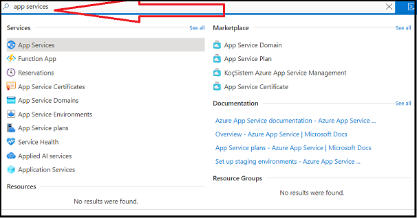
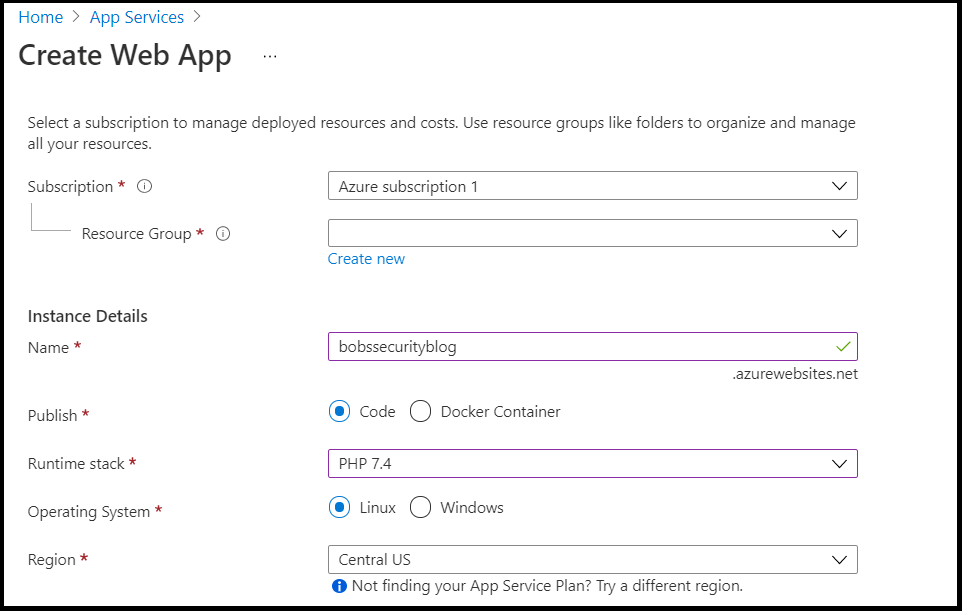
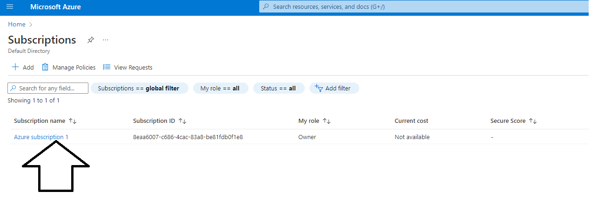
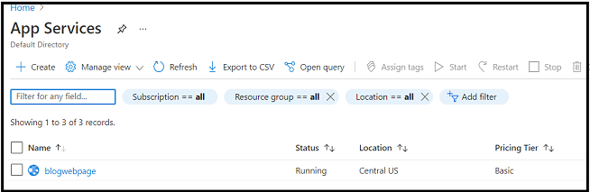
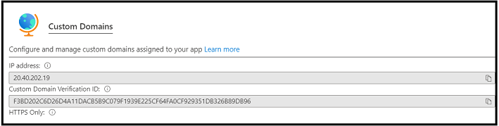
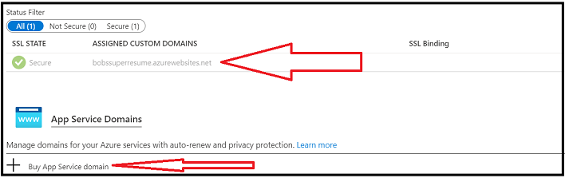
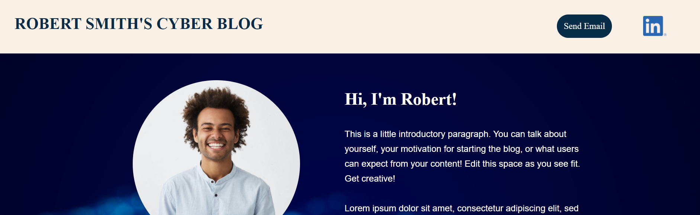
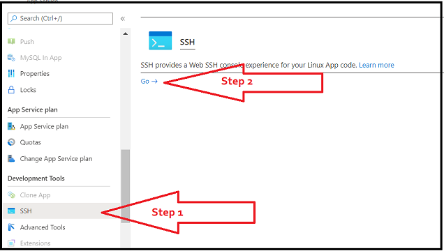
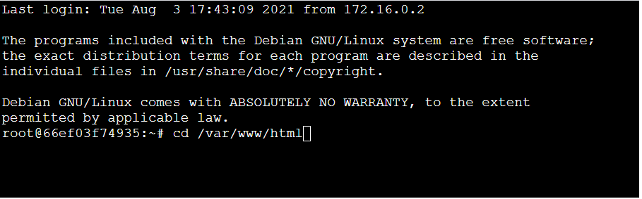

# Day 1 Activity File: Build, Host, and Design Your Web Application Using an Azure Premium Domain

Today you will build, host, and design your own web application. Specifically, you will:

  - (1) **Create an Azure web app**. 
  - (2) **Choose a domain**.
  - (3) **Deploy a container on the web app**.
  - (4) **Design your custom web application**.
  - (5) **Answer review questions**.

### Resources

- [Azure App Service Documentation](https://docs.microsoft.com/en-us/azure/app-service/)
- [How to come up with a good domain name](https://domains.google/learn/how-to-come-up-with-a-good-domain-name/)
- If Microsoft Support is needed, visit [How to open a support ticket](https://docs.microsoft.com/en-us/azure/azure-portal/supportability/how-to-create-azure-support-request)
- [Split-Half Search](https://www.peachpit.com/articles/article.aspx?p=420908&seqNum=3)
- [Top CyberSecurity Blog Websites](https://onlinedegrees.sandiego.edu/top-cyber-security-blogs-websites/)

---

### Getting Started/Prerequisites

Before you begin, you are required to have completed the following tasks from the Cloud unit:

- Created your own Azure Account (not @Cyberxsecurity).
- Created a subscription.
- Created a resource group (RedTeam was recommended during the Cloud unit).

## Instructions

### Part 1: Create an Azure Web App

In Part 1 of this activity, you will create your own Azure web application. You will name your application instance and select your back-end code and service plan. To do so, complete the following steps:

1. Begin by logging in to the Azure portal: [https://portal.azure.com](https://portal.azure.com).

	 - Make sure that you're logged in to your personal Azure account (not @Cyberxsecurity), where your Cloud Security&ndash;unit VMs are located.
	
2. Select "App Services" from the Azure search field at the top of the page, as the following image shows:

      

3. Select "+ Create" to create your application, as the following image shows:

     

4. Under the "Basics" tab, make the following selections:
   - Subscription/Resource Group: Select the same subscription nd resource group that you used during Cloud week.
   - Name: Name your instance as you see fit; note that this will be the name of the Azure app.
      - For example: "Bobssecurityresume"
   - Publish: Select "Code."
   - Runtime Stack: Select "PHP 7.4."
   - Operating System: Select "Linux."
   - Region: Select the same region that you used during Cloud week.

    The following image shows the completed "Basics" tab:

    

5. For the App Service Plan, complete the following steps:  
   - Under "Linux Plan," select "Create New" and then enter "project1plan."  
   - Under "Sku and size," select "Change size."
   - The spec picker will pop up on the right-hand side of your screen.
     - Note that this allows you to choose the pricing structure of your web app.
     - Select "Dev/Test" and "Plan B1" (the green option), and then click "Apply," as the following image shows:

      

6. Leave the default options for all of the other tabs. Select the "Review + Create" tab.

7. Select "Create" at the bottom of the screen to create your web app.

### Part 2: Choose a Domain

In this second part, you will select your own unique domain name using Azure. To do so, complete the following steps:

1. Upgrade your subscription to "Basic" to give you the ability to purchase a domain.
   
   - First, select your subscription, as the following image shows:

    
  
   - Give the page a few minutes to completely load. Then, click the option to upgrade your subscription at the top of the page, as the following image shows:

    
  
   - Make sure to select the "Basic" plan, then select "Upgrade," as the following image shows:

  

2. Once your subscription has been updated, log out of Azure and then log right back in so your changes can take effect.

3. Locate the app that you just created by selecting "App Services" from the Azure search field at the top of the page.
    
    - Your new app should now appear on the list.

    - Select your app from this page, as the following image shows:

     

4. After selecting your app, a menu of available options should appear on the left-hand side of your app. Select "Custom domains," as the following image shows:

     

5. Once this new page opens, note that your unique IP has been created, as the following image shows:

     

6.  Note that upon creation of this app, Azure provides you with a free domain.
    
    - It begins with the name that you selected and ends with ".azurewebsites.net".

7.  To begin the process of choosing your own unique domain, select "Buy App Service domain," as the following image shows:
     
     - Note: This may take up to 5 - 10 minutes after upgrading your account.

      

8. On the "Create App Service domain" page, select the same resource group that you selected before.
   - Choose a unique domain for your security blog.
      - It could be as simple as "your name + cyber blog," (e.g., **bobscyberblog.com**).
      - Note that if your chosen domain is unavailable, Azure will recommend similar names that are available.
      - Use the following [reference](https://domains.google/learn/how-to-come-up-with-a-good-domain-name/) for guidance when selecting a unique domain name.

    The following image shows this step:
    
    

9. Select the "Contact information" tab.
   - Enter the information and address as requested.
      - Note that Azure provides an option to keep this information private.

10. Leave the default options for all of the other tabs. 
   - Note that under the "Hostname Assignment" tab, you can opt out of creating the "www" subdomain.

11. Select the "Review + Create" tab.
    - Select "Create" to create your own unique domain.

12. Once you've successfully created your domain, your new domain(s) should appear on the Custom Domains page, as the following image shows:

     

     - If the domain doesn't appear, refresh your page.
     - *Note: If needed, you have five days to cancel your domain to receive a full refund*.

Congratulations! You now own your own domain, accessible on the internet!

|:warning: **Checkpoint** :warning:|
|:--|
|Before continuing, make sure that you have completed the following critical tasks:|
| :heavy_check_mark: Your Azure web app has been created. |
| :heavy_check_mark: A unique IP has been assigned to your web app. |
| :heavy_check_mark: You have selected and created your own unique domain. |

### Part 3: Deploy a Container on the Web App

In Part 3, you will use the Azure Cloud Shell to deploy a Docker container on your web application. This container contains the framework for your cyber blog webpage.

1. For your web application, you will use a Docker container that has been added to Docker Hub. View the Docker container at the following location: [Cyber Blog Framework - Docker Container](https://hub.docker.com/r/cyberxsecurity/project1-apachewebserver).

2.  Note that the Docker container image name is `cyberxsecurity/project1-apachewebserver`, as the following image shows:

     

3. Next, you will use the Azure Cloud Shell to deploy this container to your web application.
   - Azure Cloud Shell takes user input from a command line to manage Azure's cloud resources.
     - While we will use Bash, you can also use Powershell to administer your commands.
     - For additional resources on Azure's Cloud Shell, refer to the following pages:
        - [Azure Cloud Shell Overview](https://docs.microsoft.com/en-us/azure/cloud-shell/overview)
        - [Azure Web App Container commands](https://docs.microsoft.com/en-us/cli/azure/webapp/config/container?view=azure-cli-latest)
   - To open Azure Cloud Shell, click the shell logo in the tool bar at the top of the screen, as indicated by the red arrow in the following image: 
  
    
 
   - Once you've clicked this icon, the Cloud Shell will be accessible at the bottom of your page.

   - When using Shell, you may receive the following prompts:
       -  Select which shell to use (Bash or Powershell): Select "Bash."
       -  Create Storage: If a window appears, select "Create Storage."

4. Next, from the command line, you'll enter a command to configure your container.
   - There are three types of commands that manage your web app container settings:
     - (1) `az webapp config container delete` - This will delete your web app container's settings.
     - (2) `az webapp config container set` - This will set your web app container's settings.
     - (3) `az webapp config container show` - This will display the current details of your web app container's settings.
    
   - To configure your web app with your provided container, run the following: `az webapp config container set --name <name of your webapp> --resource-group <name of your resource group> --docker-custom-image-name <container-name>`
      - For example: `az webapp config container set --name bobswebapp --resource-group redteamRG --docker-custom-image-name cyberxsecurity/project1-apachewebserver`
   - After pressing enter, an output similar to the image below should appear:
    
     

5. To verify that the container has been added correctly, run the following command to **show** the container for your web app: `az webapp config container show --name <name of webapp> --resource-group <name of your resource group>`
   - For example: `az webapp config container show --name bobswebapp --resource-group redteamRG`	
 
6. Now, check the unique domain that you selected to verify that the container has been successfully deployed. 
   - A cyber blog webpage that looks like the following image should appear (note that it may take five to eight minutes to load):

   

Now, you are ready to customize your web application!
	

### Part 4: Design Your Custom Web Application

The container that you just loaded onto your web application is a framework for a cyber-blog page that you can customize.

You will now customize the following elements of the webpage:
- Your name
- Your email
- Your LinkedIn profile link
- Your introduction
- Your picture
- Two custom blog posts on topics of your choice

1. To design and customize your webpage, you'll need to access the HTML pages of your new web application.
   - To access these pages, you need to SSH over to your container and access the HTML files.
   - Return to your web app in Azure, select "SSH" from the left-hand toolbar, and then select "GO," as shown in the following image:

    
 
2. This will SSH you right into the container.
   - Once you have access, change directories to the location where the HTML files are located by running `cd /var/www/html`, as the following image shows:

   

    
3.  This directory contains the `index.html` file that makes up your webpage. To customize your webpage, complete the following steps:
    - To change your name: 
      - Run: `nano index.html`
      - Replace "ROBERT SMITH'S CYBER BLOG" with your name/text.
      - Replace "Hi, I'm Robert!" with your name/text.
    - To change your email:
      - In the same `index.html` file, replace "aaggarwal@2u.com" with your email address.
    - To change your LinkedIn profile link:
      - In the same `index.html` file, replace "https://www.linkedin.com/" with the link to your LinkedIn profile.
    - To change your introduction:
      - In the same `index.html` file, replace the paragraph beginning "This is a little introductory paragraph" with your own introduction.
    - To change your picture, follow these [instructions](https://docs.google.com/document/d/1BeNi1OvxhlxHPW_RflhDXBUPbv13fqJiWssVtM2WItc/edit).
       - Note that if you prefer not to use a photo of yourself, you can replace it with a stock photo. To do so, replace `<img src="https://drive.google.com/uc?export=view&id=1xvxRGAACLqLEMWaw6X_VatbirrIOtepy"` with this: `<img src="https://image.shutterstock.com/mosaic_250/549673/1198362232/stock-photo-hacking-and-malware-concept-hacker-using-abstract-laptop-with-binary-code-digital-interface-1198362232.jpg"`

4. Next, write and edit two blog posts on any cybersecurity topics of your choice. (Note: you can continue writing outside of class time if necessary.)
   - Each blog post should be 10 sentences minimum.
   - For inspiration, review the following cyber blogs (but do not copy directly from these or other blogs):
      - **https://www.troyhunt.com/**
      - **https://www.lastwatchdog.com/**
      - **https://krebsonsecurity.com/**
   - You can select any topic to write about from any of the domains that we have covered, including the following:
      - GRC, networking, network security, cloud, cryptography 
      - Feel free to use online resources to help you research and write your blog posts.
   - Here are some possible ideas that you could use for blog topics:
      - ***Ransomware: Should organizations pay or not?***
      - ***Who should have the final say on product security decisions, the business or the security department?***
      - ***Are humans really the weakest link in security?***
      - ***How could quantum computing affect cybersecurity?***
      - ***Should organizations try to utilize open source security software?***    

5.  Once you've written your blog posts, add your posts to your cyber blog webpage by completing the following steps:
    - Blog Topic 1
       - Change "Blog Post 1 Title" to the title of your first blog post.
       - Change "Add Keywords" to relevant keywords for your post (e.g., ransomware, cryptography).
       - Change the section beginning "Add a short description here" to the text of your blog post.
    - Blog Topic 2
       - Change "Blog Post 2 Title" to the title of your second blog post.
       - Change "Add Keywords" to relevant keywords for your post (e.g., ransomware, cryptography).
       - Change the section beginning "Add a short description here" to the text of your blog post.

After you have made your changes, return to your browser and refresh your webpage.
  - Congratulations, you now have your own cloud-hosted web blog!

### Part 5: Answer Review Questions

- Open up the [review questions](https://docs.google.com/document/d/1VoWNPNUvobnVj7F6oM2wnVO0vViaZlzgIUs43adVw1U/copy), make a copy of the document, and answer the Day 1 review questions.   
   - Note that you will submit this document as one of your deliverables at the end of the project.

---

### Day 1 Milestone

In today's class, you:
  - (1) - **Created an Azure web app**.
  - (2) - **Chose a domain**.
  - (3) - **Deployed a container on the web app**.
  - (4) - **Designed your custom web application**.
  - (5) - **Answered review questions**.

Completing these steps required you to leverage your terminal, systems administration, cloud, and automation skills. This is an impressive set of tools to have in your toolkit!

---

© 2022 Trilogy Education Services, a 2U, Inc. brand. All Rights Reserved.  
