# Part 1 Activity File: Build, Host, and Design Your Web Application Using an Azure Premium Domain

Today you will build, host, and design your own web application. Specifically, you will:

  - (1) **Create an Azure web app**. 
  - (2) **Choose a domain**.
  - (3) **Deploy a container on the web app**.
  - (4) **Design your custom web application**.
  - (5) **Answer review questions**.

### Resources

- [Azure App Service Documentation](https://docs.microsoft.com/en-us/azure/app-service/)
- [How to come up with a good domain name](https://domains.google/learn/how-to-come-up-with-a-good-domain-name/)
- If Microsoft Support is needed, visit [How to open a support ticket](https://docs.microsoft.com/en-us/azure/azure-portal/supportability/how-to-create-azure-support-request)
- [Split-Half Search](https://www.peachpit.com/articles/article.aspx?p=420908&seqNum=3)
- [Top CyberSecurity Blog Websites](https://onlinedegrees.sandiego.edu/top-cyber-security-blogs-websites/)

---

### Getting Started/Prerequisites

Before you begin, you are required to have completed the following tasks from the Cloud unit:
- Created a subscription.
- Created a resource group.

## Instructions

### Part 1: Create an Azure Web App

In Part 1 of this activity, you will create your own Azure web application. You will name your application instance and select your back-end code and service plan. To do so, complete the following steps:

1. Begin by logging in to the Azure portal: [https://portal.azure.com](https://portal.azure.com).

	 - Make sure that you're logged in to your personal Azure account, where your Cloud Security&ndash;unit VMs are located.
	
2. Select "App Services" from the Azure search field at the top of the page, as the following image shows:

      

3. Select "+ Create" to create your application, as the following image shows:

     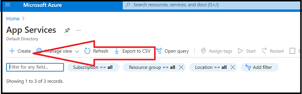

4. Under the "Basics" tab, make the following selections:
   - Subscription/Resource Group: Select the same subscription nd resource group that you used during Cloud week.
   - Name: Name your instance as you see fit; note that this will be the name of the Azure app.
      - For example: "Bobssecurityresume"
   - Publish: Select "Code."
   - Runtime Stack: Select "PHP 7.4."
   - Operating System: Select "Linux."
   - Region: Select the same region that you used during Cloud week.

    The following image shows the completed "Basics" tab:

    

5. For the App Service Plan, complete the following steps:  
   - Under "Linux Plan," select "Create New" and then enter "project1plan."  
   - Under "Sku and size," select "Change size."
   - The spec picker will pop up on the right-hand side of your screen.
     - Note that this allows you to choose the pricing structure of your web app.
     - Select "Dev/Test" and "Plan B1" (the green option), and then click "Apply," as the following image shows:

      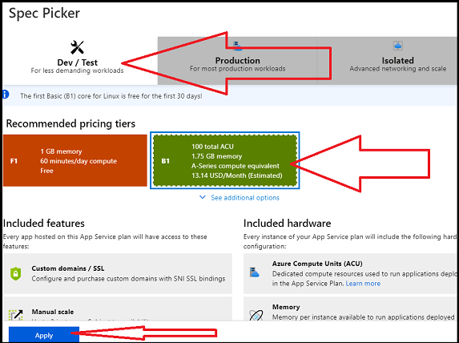

6. Leave the default options for all of the other tabs. Select the "Review + Create" tab.

7. Select "Create" at the bottom of the screen to create your web app.

### Part 2: Choose a Domain

In this second part, you will select your own unique domain name using Azure. To do so, complete the following steps:

1. Upgrade your subscription to "Basic" to give you the ability to purchase a domain.
   
   - First, select your subscription, as the following image shows:

    
  
   - Give the page a few minutes to completely load. Then, click the option to upgrade your subscription at the top of the page, as the following image shows:

    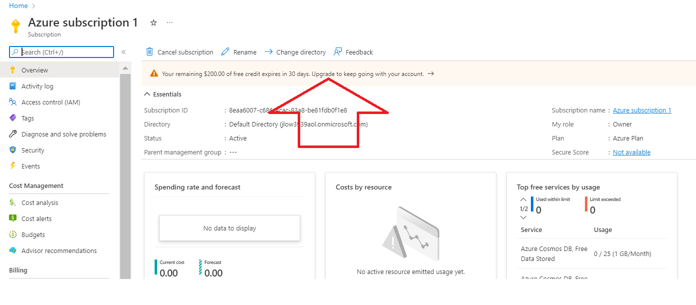
  
   - Make sure to select the "Basic" plan, then select "Upgrade," as the following image shows:

  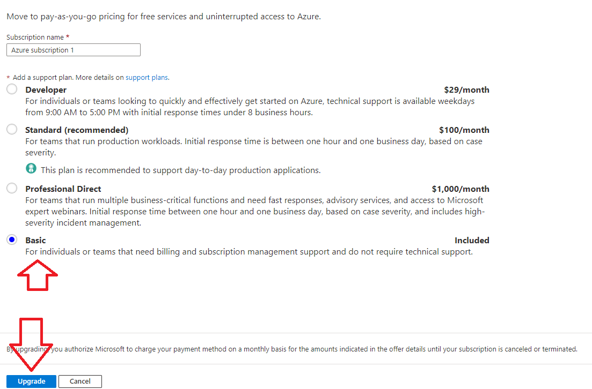

2. Once your subscription has been updated, log out of Azure and then log right back in so your changes can take effect.

3. Locate the app that you just created by selecting "App Services" from the Azure search field at the top of the page.
    
    - Your new app should now appear on the list.

    - Select your app from this page, as the following image shows:

     

4. After selecting your app, a menu of available options should appear on the left-hand side of your app. Select "Custom domains," as the following image shows:

     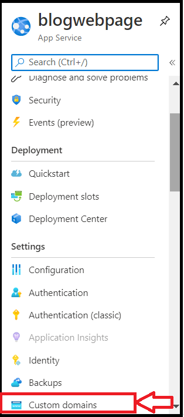

5. Once this new page opens, note that your unique IP has been created, as the following image shows:

     

6.  Note that upon creation of this app, Azure provides you with a free domain.
    
    - It begins with the name that you selected and ends with ".azurewebsites.net".

7.  To begin the process of choosing your own unique domain, select "Buy App Service domain," as the following image shows:
     
     - Note: This may take up to 5 - 10 minutes after upgrading your account.

      

8. On the "Create App Service domain" page, select the same resource group that you selected before.
   - Choose a unique domain for your security blog.
      - It could be as simple as "your name + cyber blog," (e.g., **bobscyberblog.com**).
      - Note that if your chosen domain is unavailable, Azure will recommend similar names that are available.
      - Use the following [reference](https://domains.google/learn/how-to-come-up-with-a-good-domain-name/) for guidance when selecting a unique domain name.

    The following image shows this step:
    
    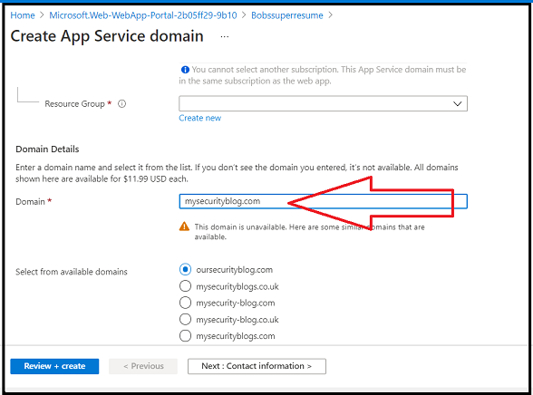

9. Select the "Contact information" tab.
   - Enter the information and address as requested.
      - Note that Azure provides an option to keep this information private.

10. Leave the default options for all of the other tabs. 
   - Note that under the "Hostname Assignment" tab, you can opt out of creating the "www" subdomain.

11. Select the "Review + Create" tab.
    - Select "Create" to create your own unique domain.

12. Once you've successfully created your domain, your new domain(s) should appear on the Custom Domains page, as the following image shows:

     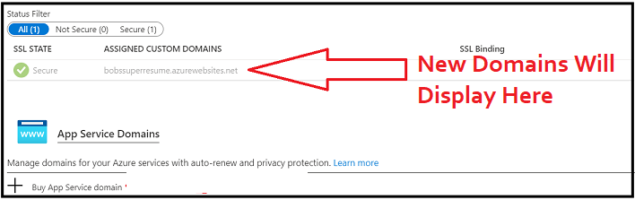

     - If the domain doesn't appear, refresh your page.
     - *Note: If needed, you have five days to cancel your domain to receive a full refund*.

Congratulations! You now own your own domain, accessible on the internet!

|:warning: **Checkpoint** :warning:|
|:--|
|Before continuing, make sure that you have completed the following critical tasks:|
| :heavy_check_mark: Your Azure web app has been created. |
| :heavy_check_mark: A unique IP has been assigned to your web app. |
| :heavy_check_mark: You have selected and created your own unique domain. |

### Part 3: Deploy a Container on the Web App

In Part 3, you will use the Azure Cloud Shell to deploy a Docker container on your web application. This container contains the framework for your cyber blog webpage.

1. For your web application, you will use a Docker container that has been added to Docker Hub. View the Docker container at the following location: [Cyber Blog Framework - Docker Container](https://hub.docker.com/r/cyberxsecurity/project1-apachewebserver).

2.  Note that the Docker container image name is `cyberxsecurity/project1-apachewebserver`, as the following image shows:

     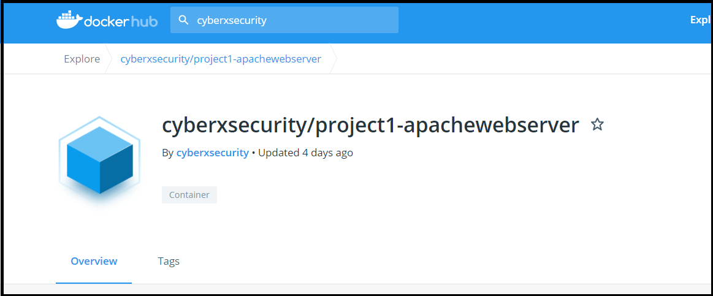

3. Next, you will use the Azure Cloud Shell to deploy this container to your web application.
   - Azure Cloud Shell takes user input from a command line to manage Azure's cloud resources.
     - While we will use Bash, you can also use Powershell to administer your commands.
     - For additional resources on Azure's Cloud Shell, refer to the following pages:
        - [Azure Cloud Shell Overview](https://docs.microsoft.com/en-us/azure/cloud-shell/overview)
        - [Azure Web App Container commands](https://docs.microsoft.com/en-us/cli/azure/webapp/config/container?view=azure-cli-latest)
   - To open Azure Cloud Shell, click the shell logo in the tool bar at the top of the screen, as indicated by the red arrow in the following image: 
  
    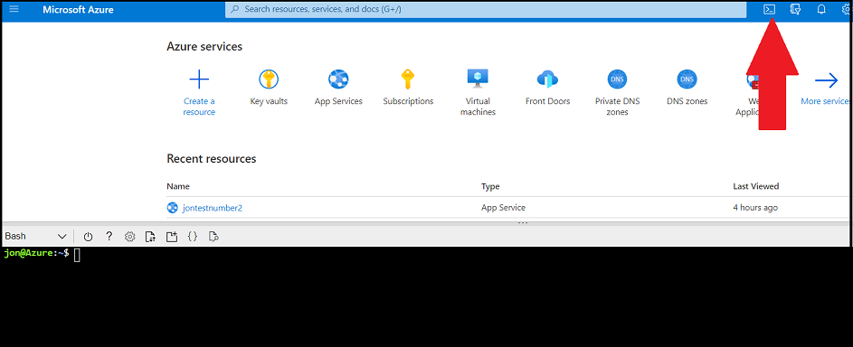
 
   - Once you've clicked this icon, the Cloud Shell will be accessible at the bottom of your page.

   - When using Shell, you may receive the following prompts:
       -  Select which shell to use (Bash or Powershell): Select "Bash."
       -  Create Storage: If a window appears, select "Create Storage."

4. Next, from the command line, you'll enter a command to configure your container.
   - There are three types of commands that manage your web app container settings:
     - (1) `az webapp config container delete` - This will delete your web app container's settings.
     - (2) `az webapp config container set` - This will set your web app container's settings.
     - (3) `az webapp config container show` - This will display the current details of your web app container's settings.
    
   - To configure your web app with your provided container, run the following: `az webapp config container set --name <name of your webapp> --resource-group <name of your resource group> --docker-custom-image-name <container-name>`
      - For example: `az webapp config container set --name bobswebapp --resource-group redteamRG --docker-custom-image-name cyberxsecurity/project1-apachewebserver`
   - After pressing enter, an output similar to the image below should appear:
    
     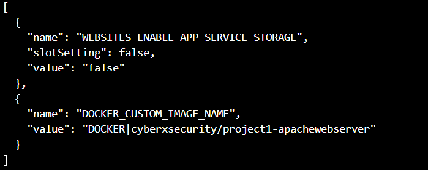

5. To verify that the container has been added correctly, run the following command to **show** the container for your web app: `az webapp config container show --name <name of webapp> --resource-group <name of your resource group>`
   - For example: `az webapp config container show --name bobswebapp --resource-group redteamRG`	
 
6. Now, check the unique domain that you selected to verify that the container has been successfully deployed. 
   - A cyber blog webpage that looks like the following image should appear (note that it may take five to eight minutes to load):

   

Now, you are ready to customize your web application!
	

### Part 4: Design Your Custom Web Application

The container that you just loaded onto your web application is a framework for a cyber-blog page that you can customize.

You will now customize the following elements of the webpage:
- Your name
- Your email
- Your LinkedIn profile link
- Your introduction
- Your picture
- Two custom blog posts on topics of your choice

1. To design and customize your webpage, you'll need to access the HTML pages of your new web application.
   - To access these pages, you need to SSH over to your container and access the HTML files.
   - Return to your web app in Azure, select "SSH" from the left-hand toolbar, and then select "GO," as shown in the following image:

    
 
2. This will SSH you right into the container.
   - Once you have access, change directories to the location where the HTML files are located by running `cd /var/www/html`, as the following image shows:

   

    
3.  This directory contains the `index.html` file that makes up your webpage. To customize your webpage, complete the following steps:
    - To change your name: 
      - Run: `nano index.html`
      - Replace "ROBERT SMITH'S CYBER BLOG" with your name/text.
      - Replace "Hi, I'm Robert!" with your name/text.
    - To change your email:
      - In the same `index.html` file, replace "aaggarwal@2u.com" with your email address.
    - To change your LinkedIn profile link:
      - In the same `index.html` file, replace "https://www.linkedin.com/" with the link to your LinkedIn profile.
    - To change your introduction:
      - In the same `index.html` file, replace the paragraph beginning "This is a little introductory paragraph" with your own introduction.
    - To change your picture, follow these [instructions](https://docs.google.com/document/d/1BeNi1OvxhlxHPW_RflhDXBUPbv13fqJiWssVtM2WItc/edit).
       - Note that if you prefer not to use a photo of yourself, you can replace it with a stock photo. To do so, replace `<img src="https://drive.google.com/uc?export=view&id=1xvxRGAACLqLEMWaw6X_VatbirrIOtepy"` with this: `<img src="https://image.shutterstock.com/mosaic_250/549673/1198362232/stock-photo-hacking-and-malware-concept-hacker-using-abstract-laptop-with-binary-code-digital-interface-1198362232.jpg"`

4. Next, write and edit two blog posts on any cybersecurity topics of your choice. (Note: you can continue writing outside of class time if necessary.)
   - Each blog post should be 10 sentences minimum.
   - For inspiration, review the following cyber blogs (but do not copy directly from these or other blogs):
      - **https://www.troyhunt.com/**
      - **https://www.lastwatchdog.com/**
      - **https://krebsonsecurity.com/**
   - You can select any topic to write about from any of the domains that we have covered, including the following:
      - GRC, networking, network security, cloud, cryptography 
      - Feel free to use online resources to help you research and write your blog posts.
   - Here are some possible ideas that you could use for blog topics:
      - ***Ransomware: Should organizations pay or not?***
      - ***Who should have the final say on product security decisions, the business or the security department?***
      - ***Are humans really the weakest link in security?***
      - ***How could quantum computing affect cybersecurity?***
      - ***Should organizations try to utilize open source security software?***    

5.  Once you've written your blog posts, add your posts to your cyber blog webpage by completing the following steps:
    - Blog Topic 1
       - Change "Blog Post 1 Title" to the title of your first blog post.
       - Change "Add Keywords" to relevant keywords for your post (e.g., ransomware, cryptography).
       - Change the section beginning "Add a short description here" to the text of your blog post.
    - Blog Topic 2
       - Change "Blog Post 2 Title" to the title of your second blog post.
       - Change "Add Keywords" to relevant keywords for your post (e.g., ransomware, cryptography).
       - Change the section beginning "Add a short description here" to the text of your blog post.

After you have made your changes, return to your browser and refresh your webpage.
  - Congratulations, you now have your own cloud-hosted web blog!

### Part 5: Answer Review Questions

- Open up the [review questions](https://docs.google.com/document/d/1VoWNPNUvobnVj7F6oM2wnVO0vViaZlzgIUs43adVw1U/copy), make a copy of the document, and answer the Part 1 review questions.   
   - Note that you will submit this document as one of your deliverables at the end of the project.

---

### Part 1 Milestone

In today's class, you:
  - (1) - **Created an Azure web app**.
  - (2) - **Chose a domain**.
  - (3) - **Deployed a container on the web app**.
  - (4) - **Designed your custom web application**.
  - (5) - **Answered review questions**.

Completing these steps required you to leverage your terminal, systems administration, cloud, and automation skills. This is an impressive set of tools to have in your toolkit!

---

# Part 2 Activity File: Secure Your Web Application with SSL Certificates (Azure Premium and GoDaddy Domain Version)

Today, you will secure your web application. Specifically, you will:

  - (1) **Create a key vault**.
  - (2) **Create a self-signed certificate**.
  - (3) **Import and bind your self-signed certificate to your web app**.
  - (4) **Create and bind an app service managed certificate**.
  - (5) **Answer review questions**.

⚠️ Note: You will purposely create and add **two** types of SSL certificates to your web application to experience the advantages and disadvantages of each certificate.

### Resources

- [Azure Key Vaults](https://azure.microsoft.com/en-us/services/key-vault/#product-overview)
- [What is a self signed certificate?](https://sectigostore.com/page/what-is-a-self-signed-certificate/)
- [Binding Certificates in Azure](https://docs.microsoft.com/en-us/azure/app-service/configure-ssl-bindings#bind-your-ssl-certificate)
- [Azure App Service Managed Certificates](https://azure.microsoft.com/en-us/updates/secure-your-custom-domains-at-no-cost-with-app-service-managed-certificates-preview/)
- [Azure App Service Documentation](https://docs.microsoft.com/en-us/azure/app-service/)
- If Microsoft Support is needed, visit [How to open a support ticket](https://docs.microsoft.com/en-us/azure/azure-portal/supportability/how-to-create-azure-support-request)

---

### Getting Started/Prerequisites

Before you begin Part 2, you are required to have completed the following tasks from Part 1:

- Created your own web application.
- Created your own unique domain name.
- Deployed a Docker container to your web application.
- Customized your web application with your own unique content.

## Instructions

### Part 1: Create a Key Vault

In this first part, you will create an Azure key vault. To do so, complete the following steps:

1. Begin by logging in to the Azure portal: [https://portal.azure.com](https://portal.azure.com).

	 - Make sure that you're logged in to your personal Azure account (not @Cyberxsecurity), where your Cloud Security&ndash;unit VMs are located.
	
2. Select "Key vaults" from the Azure search field at the top of the page, as the following image shows:

      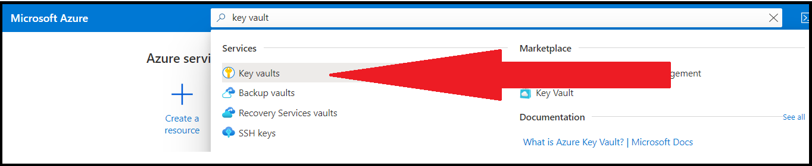
 
3. Select "+ Create" from the Key Vault page to create your key vault, as the following image shows:

      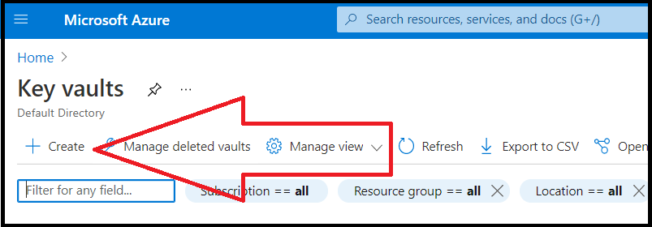
 
4. On the "Create key vault" tab, make the following selections:
   - Subscription/Resource Group: Select the same subscription and resource groups that you selected on Part 1.
   - Key Vault Name: Choose a key vault name, such as `project1_KeyVault`. (Note: This name must be globally unique, so you will be prompted to choose a different name if the one you enter has been used before.)
   - Region: Select the same region that you selected on Part 1.
   - Pricing tier: Select the "Standard" tier.
   - Leave the default options for all of the other tabs (Access Policy, Networking, Tags).
  
   The following image shows the completed "Create key vault" tab:

   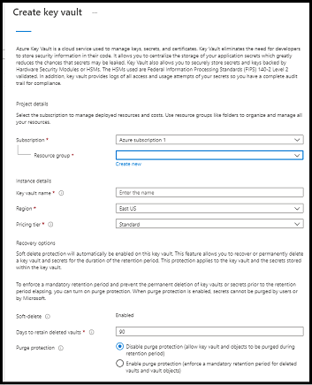
  
   - Finally, select "Review + Create" to create your key vault.

5. After your key vault has been created, select your new resource to view your new key vault.

6. Preview the options available on your key vault to store secure information, including:
   - **Keys**
   - **Secrets**
   - **Certificates**

   The following image shows these options:

    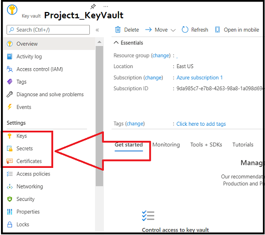

### Part 2: Create a Self-Signed Certificate

In this second part, you will return to the command line to create a self-signed certificate using OpenSSL. To do so, complete the following steps:

1.  From your Azure portal, access the same Cloud Shell that you accessed on Part 1 to load the Docker container, as the following image shows:

     

     - From this command line, you will now use the open source cryptography and SSL/TLS "toolkit" **OpenSSL** (it is preinstalled).
         - Recall that during Cryptography week, we used OpenSSL to generate keys and an IV to encrypt a message.

2. Next, you will use OpenSSL to generate a **self-signed certificate**.
     - A self-signed certificate is a certificate that has not been signed by a certificate authority.
     - These certificates are simple to create and have no expense.
     - We will explore their advantages and disadvantages in today's review questions.

3. From the command line, enter the following command: `openssl req -x509 -sha256 -nodes -days 365 -newkey rsa:2048 -keyout <privatekeyname.key> -out <certificatename.crt> -addext "extendedKeyUsage=serverAuth"`
     - For example: `openssl req -x509 -sha256 -nodes -days 365 -newkey rsa:2048 -keyout project1_key.key -out project1_cert.crt -addext "extendedKeyUsage=serverAuth"`
     - The following image shows this step:
      
        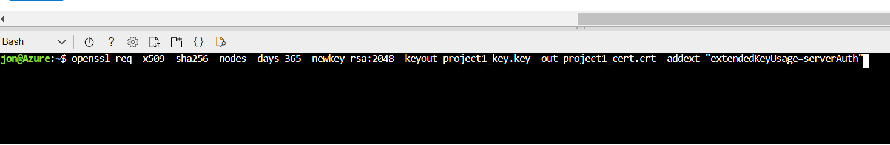 
 
     - We added the following options: 
         -  **-x509**: Indicates for OpenSSL to create an SSL certificate.
         -  **-sha256**: Uses the sha256 hashing algorithm.
         -  **-nodes** 
         -  **-days 365**: States the certificate will be valid for one year.
         -  **-newkey rsa:2048**: Uses a 2048-bit RSA key.
         -  **-keyout project1_key.key**: The outputted name of the private key.
         -  **-out project1_cert.crt**: The outputted name of the certificate.
         -  **-addext "extendedKeyUsage=serverAuth"**: Indicates how a public key can be used.

     - Refer to the following [document](https://wiki.openssl.org/index.php/Command_Line_Utilities) for additional information on OpenSSL options.

4. After pressing Enter, you will be asked several questions about your certificate. Answer the following:

      - **Country Name (2 letter code) [AU]**: Enter your country.
      - **State or Province Name (full name) [Some State]**: Enter your state.
      - **Locality Name (e.g., city) [ ]**: Enter your city.
      - **Organization Name (e.g., company) [Internet Widgits Pty Ltd]**: Enter "Student".
      - **Organizational Unit Name (e.g., section) [ ]**: Leave blank by pressing Enter.
      - **Common Name (e.g., server FQDN or YOUR name) [ ]**: Enter your full domain name, such as "bobsblog.com".
      - **Email Address [ ]:** Leave blank by pressing Enter.

      The following image shows this step:

      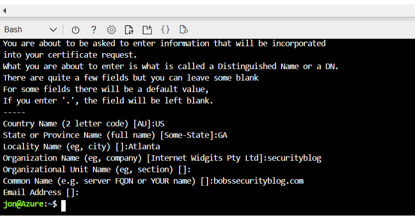 

5. Now, view your newly created key (`.key`) and certificate (`.crt`) by running `ls`, as the following image shows:

       

      -  Note that Azure requires a PFX format for its certificates.
          - The PFX format is the server certificate and the private key combined into a single encrypted file. 

6. To create a PFX format, run the following command: `openssl pkcs12 -export -out <new_certificatename.pfx> -inkey <keyname.key> -in <certificename.crt>`
     - For example: `openssl pkcs12 -export -out project1_cert.pfx -inkey project1_key.key  -in project1_cert.crt`

     - We added the following options:
         -  **pkcs12**: Indicates for OpenSSL to create a PFX certificate.
         -  **-export -out project1_cert.pfx**: States what to name the PFX file.
         -  **-inkey project1_key.key**: This is the current private key that you are importing.
         -  **-in project1_cert.crt**: This is the current certificate that you are importing.

7. After pressing Enter, you will be prompted for a password to encrypt your PFX key.
     - Don't forget your password, as you will be prompted for it again shortly!
     - The following image shows this step:

      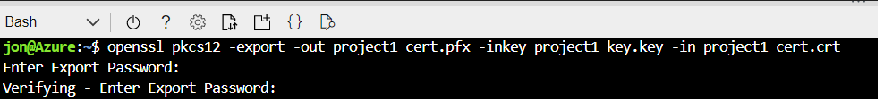 

8.  View your new PFX certificate by running `ls`, as the following image shows:

       
 
9.  To download your new PFX certificate, complete the following four steps:
     - (1) Click the "Upload/Download" icon in the toolbar above your Cloud Shell window.
     - (2) Select "Download."
     - (3) Enter the name of your PFX certificate in the "Download a file" window.
     - (4) Click "Download." 
     
     The following image shows these steps:

      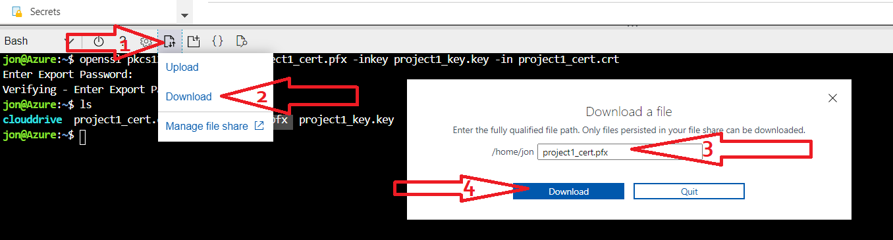 

### Part 3: Import and Bind Your Self-Signed Certificate to Your Web App

In this part, you will use Azure to import and bind the certificate that you just added to your web application. To do so, complete the following steps:

1. From the Azure Portal, select "Key Vaults."
     - Select the key vault that you created in Part 1.

2. From your key vault, select "Certificates" and then "+ Generate/Import," as the following image shows:

     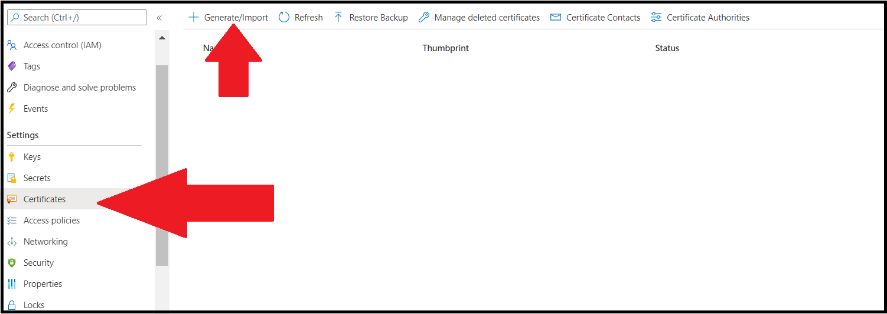
 
3. On the "Create a certificate" page, select the following:
      - **Method of Certificate Creation**: Import
      - **Certificate Name**: project1PFX-cert
      - **Upload Certificate File**: Select your PFX certificate (it's likely in your `Downloads` folder)
      - **Password**: Enter the password that you created in Part 2

      The following image shows these steps:

      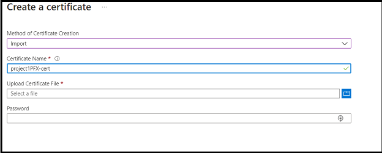

4. Select "Create" to upload your certificate.
     - The following success message should appear to confirm that your PFX certificate has been uploaded to your key vault:

     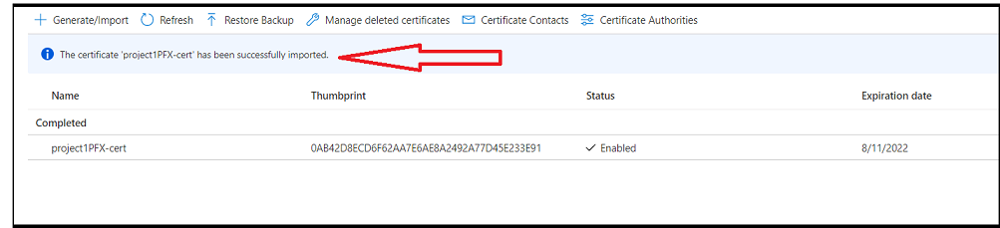
 
 
5. Now that you have uploaded your certificate, it's time to add it to your web application. To do so, complete the following steps:
     - Return to the web application (under "App Services") that you created on Part 1.
     - On this page, select "TLS/SSL Settings," as the following image shows:

      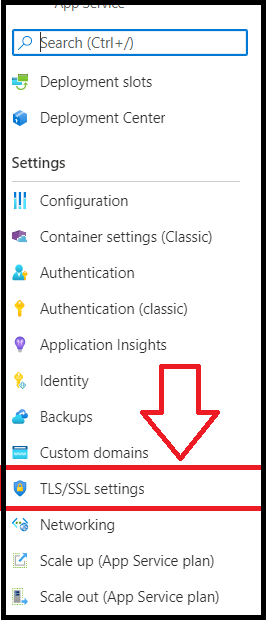
 
6. On this page, import your new PFX certificate from your key vault. To do so, complete the following steps:
      - (1) Select "Private Key Certificates."
      - (2) Click "+ Import Key Vault Certificate."
      - (3) When the pane opens on the right side of your screen, enter your subscription, key vault, and certificate that you just created.

      The following image shows these steps:

      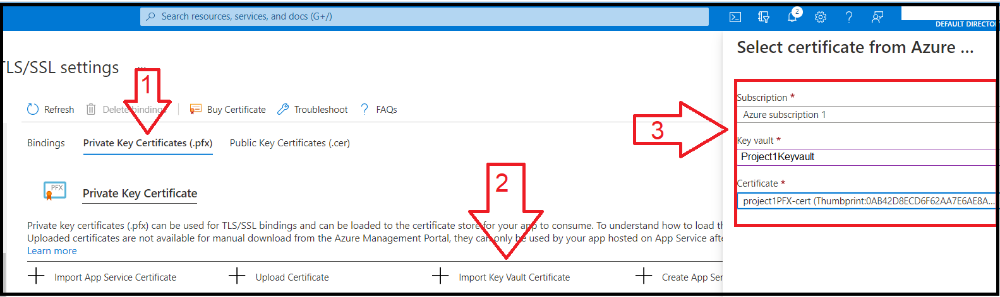

7. Your certificate should now appear as an available certificate to use for your web application, as the following image shows:

      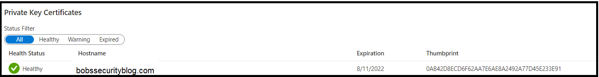
 
8. Currently your certificate is just available to use for your web application&mdash;now, it is time to bind it! To bind your certificate, complete the following steps:
     - Select "Bindings."
     - Toggle "HTTPS Only" to "On."
     - Toggle "Minimum TLS Version" to "1.2."
     - Click "+ Add TLS/SSL Binding."
     - When the pane appears on the right side of your screen, select your domain, the matching certificate, and "SNI/SSL" for the TLS/SSL type.

     The following image shows these steps:

     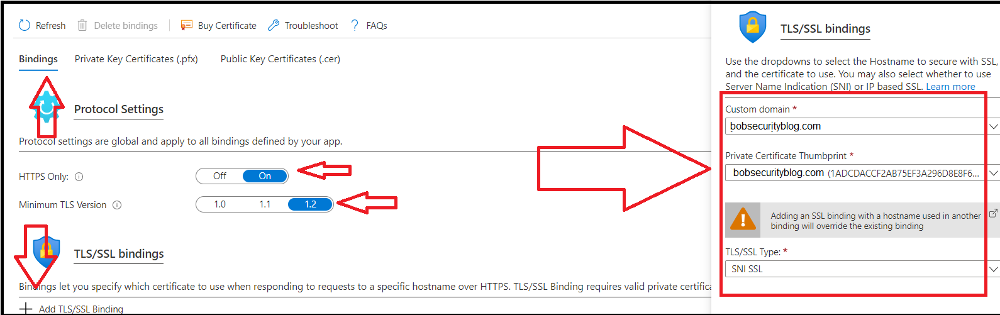
 
9. After selecting "Add Binding," your binding should appear in the "TLS/SSL bindings" list, as the following image shows:

     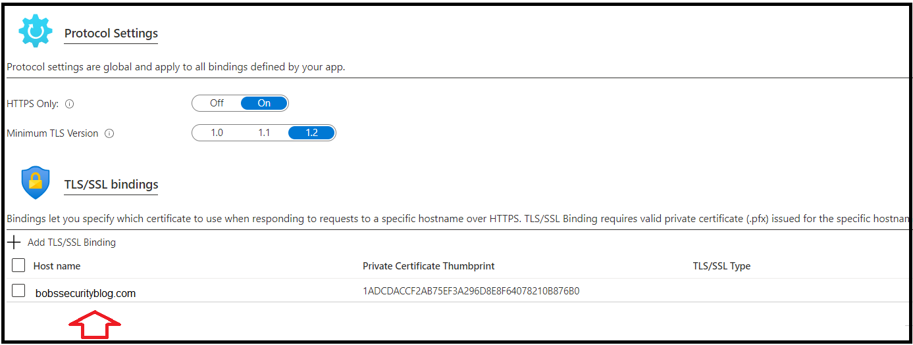

10. Now, open a browser and access your web application.
     - Did your browser return an error like the one shown in the following image?

     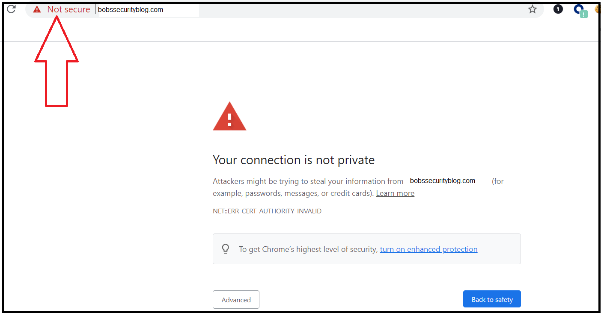

     - Note that this image is from the Chrome browser; the message may look slightly different depending on your browser.

11. Let's examine the certificate that you just added. Click "Not secure" in the search bar if you are in Chrome, or a similar message depending on your browser, as shown in the following image:

    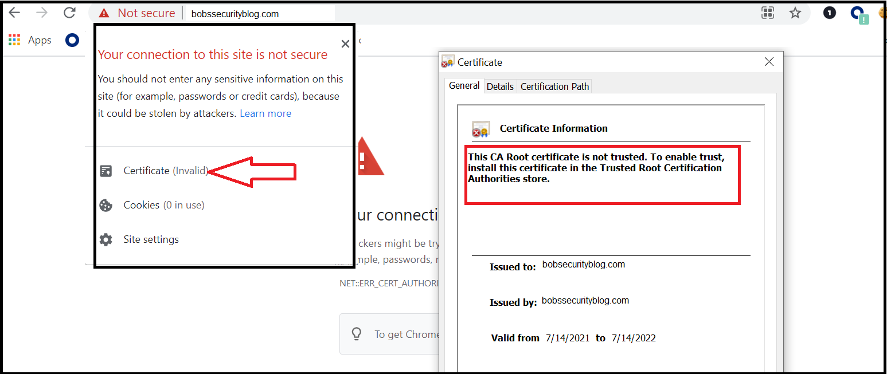

     - After selecting "Not secure," select "Certificate (Invalid)" from the menu to examine your certificate.
     - Note the reason for your error based on the message on your certificate. This message is due to the fact that your certificate was created by you and not a trusted CA.

12. Next, click the "Details" tab of your certificate, then select the "Subject" option, as the following image shows:

     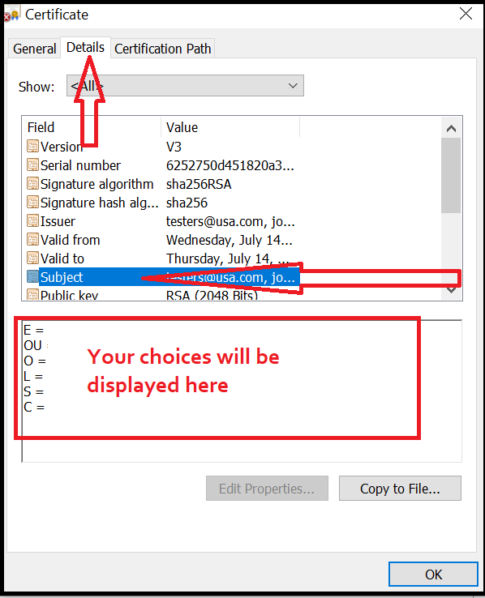

     - Note the results that now display in the box on the bottom; these were the options that you selected when you created your certificate with OpenSSL.

You have successfully created a self-signed certificate and bound it to your web application using Azure!

|:warning: **Checkpoint** :warning:|
|:--|
|Before continuing, make sure that you have completed the following critical tasks:|
| :heavy_check_mark: Created your Azure key vault. |
| :heavy_check_mark: Created a self-signed certificate using Open SSL. |
| :heavy_check_mark: Imported and bound your self-signed certificate to your web app. |

	
### Part 4: Create and Bind an App Service Managed Certificate

In this part, you will use Azure's managed certificate to create and bind a more secure certificate to your web application.

You were just able to create and bind your own self-signed certificate to your web application to encrypt your web traffic. However, unfortunately, your browser displayed warnings to visitors that your website is not trusted and that there may be security risks associated with your web application. (Note that you will explore this issue further in the daily review questions.)

You will now create and bind a more secure, trusted SSL certificate to your web app using Azure's cloud services. To do so, complete the following steps:

1.  First, return to "TLS/SSL settings" under your web application.
2.  Select "Private Key Certificates."
3.  Select "+ Create App Service Managed Certificates."
4.  When the pop-up appears on the right side of your screen, select your domain and click "Create," as the following image shows:

      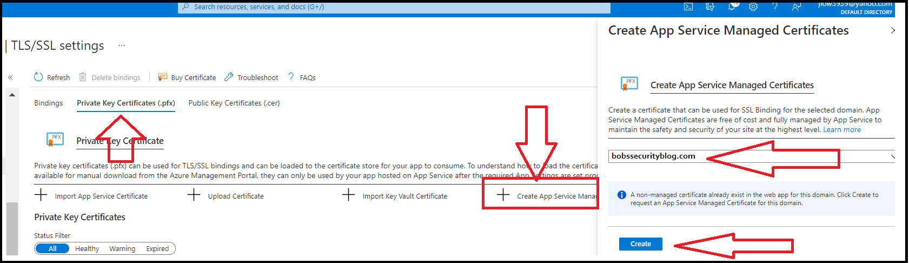

5. Once your app service managed certificate has been created, return to the "Bindings" tab.
6. Select "+ Add TLS/SSL Binding."
7. When the pane appears on the right side of your screen, select your domain and the new certificate that you just created.
     - Note the current thumbprint next to your domain under the "TLS/SSL bindings" menu, and select the certificate with the other thumbprint, as the following image shows: 

      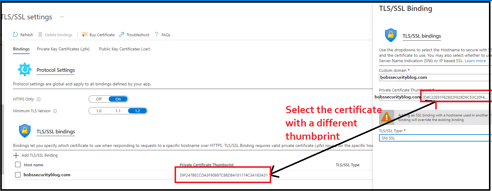

8. Select "SNI/SSL" for the TLS/SSL type, then click "Add Binding."

9. Now that your new app services managed certificate has been bound to your web application, revisit your website. You should not see any warnings displayed this time!

Congratulations, you have now created a web application and secured it with a trusted SSL certificate!

### Part 5: Answer Review Questions

- Open your copy of the [review questions](https://docs.google.com/document/d/1VoWNPNUvobnVj7F6oM2wnVO0vViaZlzgIUs43adVw1U/edit?usp=sharing), make a copy of the document, and answer the Part 2 review questions.   
     - Note that you will submit this document as one of your deliverables at the end of the project.

---

### Part 2 Milestone

In today's class, you:
  - (1) **Created a key vault**. 
  - (2) **Created a self-signed certificate**.
  - (3) **Imported and bound your self-signed certificate to your web app**.
  - (4) **Created and bound an app service managed certificate**.
  - (5) **Answered review questions**.

Completing these steps required you to leverage your terminal, systems administration, cloud, cryptography, and networking skills. This is an impressive set of tools to have in your toolkit!

---

# Part 3 Activity File: Protect Your Web Application with Azure's Security Features

Today, you will be protecting your web application. Specifically, you will be working on:

  - (1) **Create a front door instance**.
  - (2) **Analyze WAF rule sets**.
  - (3) **Configure custom WAF rules**.
  - (4) **Analyze and remediate Security Center recommendations**.
  - (5) **Answer review questions**.
  - (6) **Conclude and submit your project**.

### Resources

- [Azure Front Door Documentation](https://azure.microsoft.com/en-us/services/frontdoor/#overview)
- [Azure Front Door Locations by Region](https://docs.microsoft.com/en-us/azure/frontdoor/edge-locations-by-region)
- [Azure Web Application Firewall on Front Door](https://docs.microsoft.com/en-us/azure/web-application-firewall/afds/afds-overview)
- [Azure Security Center Documentation](https://docs.microsoft.com/en-us/azure/security-center/)
- If Microsoft Support is needed, visit [How to open a support ticket](https://docs.microsoft.com/en-us/azure/azure-portal/supportability/how-to-create-azure-support-request)

---

### Getting Started / Pre-requisites

Before you begin Part 3, you are required to have completed the following tasks from Part 2:

- Created a key vault.
- Created a self-signed certificate.
- Imported and Bound your self-signed certificate to your web app (Paid domains)
- Created and Bound an App Service Managed Certificate (Paid domains)
- Analyzed and compared self-signed certificates and trusted certificates.

## Instructions

### Part 1: Create a Front Door Instance

In this first part, you will create an Azure Front Door instance. To do so, complete the following steps: 

1. Begin by logging in to the Azure portal: [https://portal.azure.com](https://portal.azure.com).

	 - Make sure that you're logged in to your personal Azure account (not @Cyberxsecurity), where your Cloud Security&ndash;unit VMs are located.
	
2. Next, access the app service resource that you created on Part 1.

3. From the menu on the left side of the screen, select "Networking."

4. From this page, select "Azure Front Door" under "More networking features," as the following image shows:

     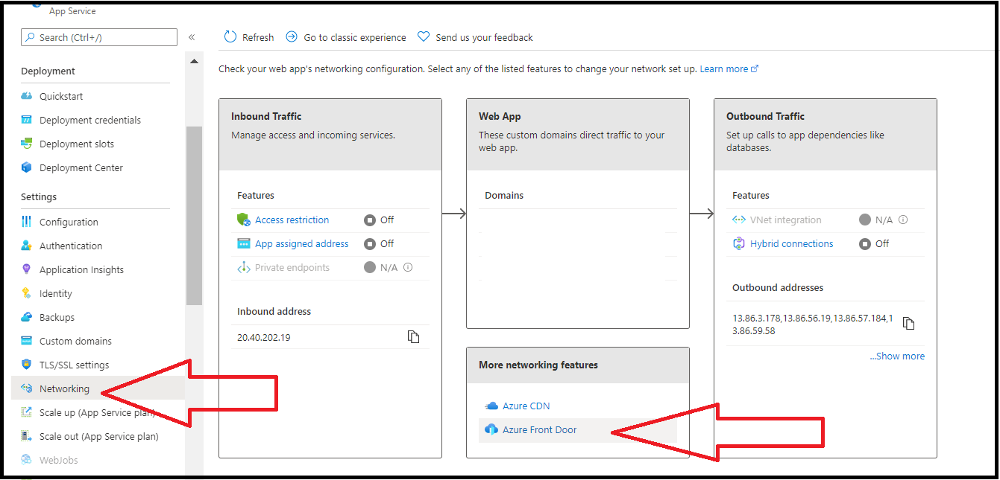
 
5. On the next page, since you haven't created your Front Door resource yet, select "Create new" under "Front Door instance."

6. This will open a pane on the right side of your screen.  
   - In this pane, name your Front Door "project1-FrontDoor".
   - Leave the default settings to create a default **web application firewall (WAF)**.
   - Click the "Add" button at the bottom of the pane, as the following image shows:

     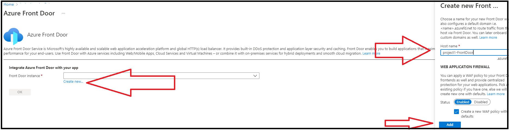
 
7. This will return you to the Azure Front Door page.
     - Click "OK" to update the Front Door instance to your application, as the following image shows:

     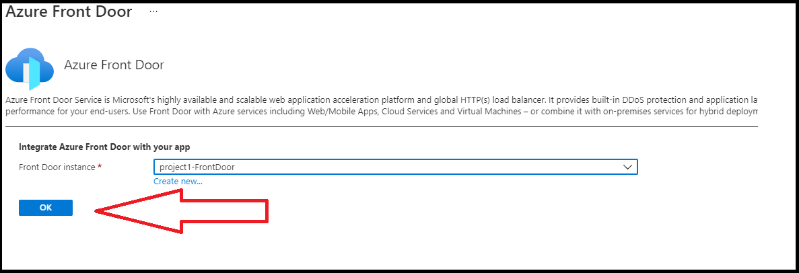

8. To verify that your Front Door instance has been set up correctly, select "Azure Front Door" (from Step 4) again.

9. The message "Azure Front Door is configured for your web app" should display as confirmation, as shown in the following image:
 
     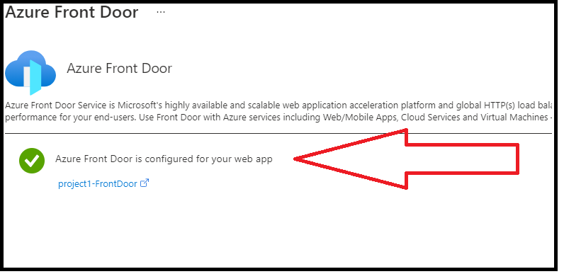

10.  Take a screenshot of this confirmation.

### Part 2: Analyze WAF Rule Sets

In this second part, you will view the features that are provided by your web application firewall. To do so, complete the following steps:

1.  From your Azure portal, enter "web app" until "Web Application Firewall policies (WAF)" appears as one of the choices in the dropdown.

2.  Select that option. The WAF that you created during the previous step should display on the "Web Application Firewall policies (WAF)" page. 
     - Note: It will begin with "project1frontdoor" and end with several random letters and numbers.

3. Select your WAF, as the following image shows:

     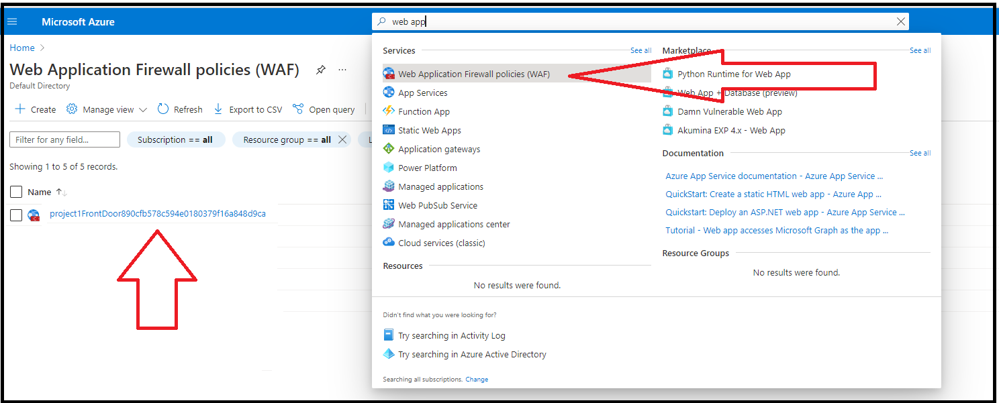
 
4. When your WAF policies page opens, notice the options on the left side of your screen.

5. Select "Managed rules" either from the left-hand toolbar or from the box on the bottom of the page, as the following image shows:

     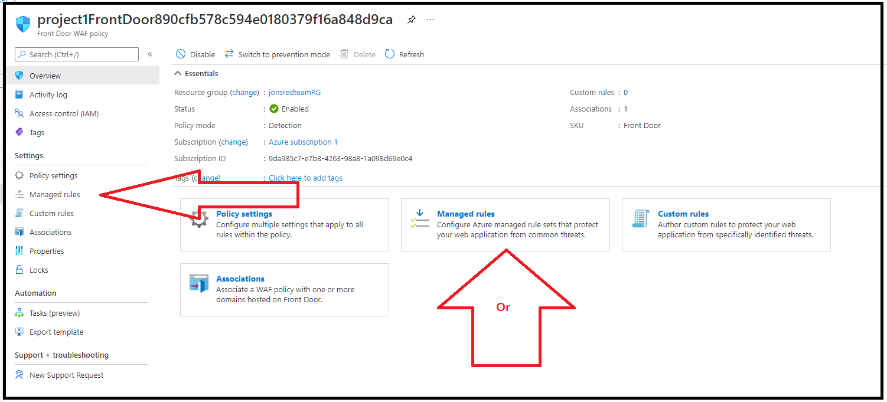

6. When the "Managed rules" page appears, scroll through the page to view the various rules, as shown in the following image:

     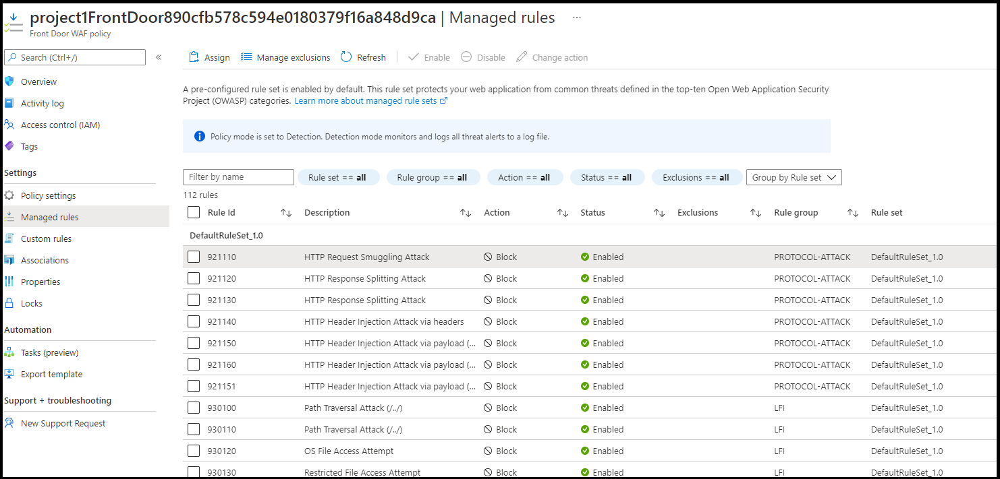

     - Note the following about these rules:
        - This is the list of the application vulnerabilities that the WAF will protect against (we will explore these vulnerabilities in further detail in the Web Vulnerabilities unit).
       - While it's unlikely that your web application would be impacted by these vulnerabilities, this exercises illustrates the Azure WAF feature, which identifies and blocks the application attacks indicated on this page.
       - These managed rules can be individually enabled or disabled, and a variety of actions can be taken if an attack is identified, such as:
          - Allow the request.
          - Block the request.
          - Log the request.
          - Redirect the request to another webpage.

### Part 3: Configure Custom WAF Rules

In this part, you will configure a custom WAF rule to protect against a potential security attack.

Let's assume for this project that you have been experiencing a variety of attacks from international IP addresses, and you need to only accept traffic from the locations where your business partners reside: the United States, Canada, and Australia.

Now, you'll learn how to create a custom rule on your web application to protect against these attacks. To do so, complete the following steps:

1. Select "Custom rules" from the toolbar on the left-hand side of the screen, as the following image shows:

     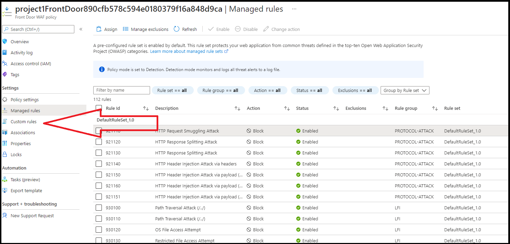
 

2. To create a custom rule, select "+ Add custom rule."
     - When the pane pops up on the right, name your custom rule "Project1rule."
     - Leave the status and rule type at the default options.
     - Set the priority to 100.
     - Set the following terms for the rule's condition:
        - Match type: Geo location
        - Operation: is not
        - Select the three countries (USA, Canada, Australia)
        - Then: Deny traffic
     - Then, click "Add." 
     - The following image shows these steps:

     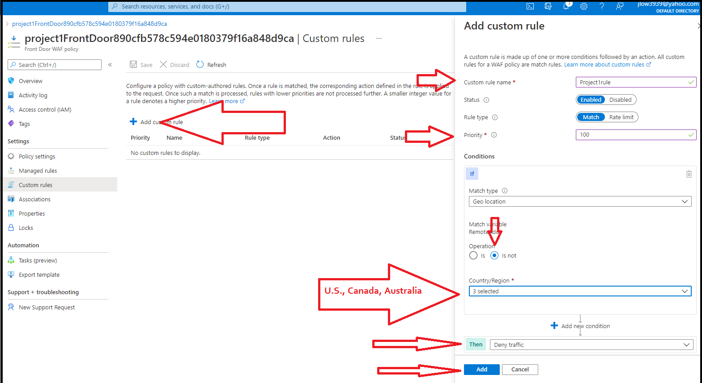

3. Your custom rule should now display on the page, as the following image shows:

     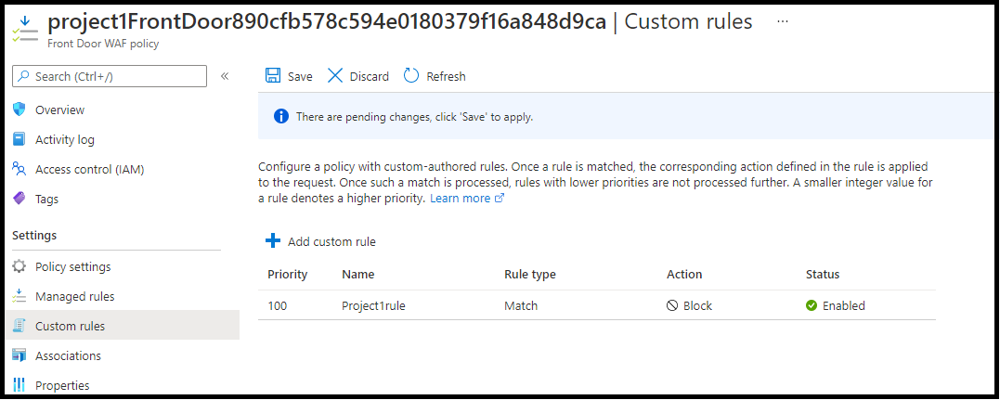

4. Take a screenshot of your custom rule. Press "Save".

5. Congratulations! You have configured the WAF to restrict traffic from accessing your webpage unless the source IP is from the US, Canada, or Australia. 

|:warning: **Checkpoint** :warning:|
|:--|
|Before continuing, make sure that you have completed the following critical tasks:|
| :heavy_check_mark: Created your Azure Front Door instance. |
| :heavy_check_mark: Created a WAF and analyzed your rule sets. |
| :heavy_check_mark: Created a custom WAF rule to protect against international traffic. |

	
### Part 4: Analyze and Fix a Security Center Recommendation

**Azure Security Center** is a management system that provides best practices and recommendations to enhance the security of your cloud resources.

While Azure provides tools to protect your cloud resources, it is up to you to apply the correct configurations and best practices to protect your web application.

In this part, you will learn how to use Azure Security Center to analyze and fix a recommendation from the Security Center dashboard. To do so, complete the following steps:

1.  To access Azure Security Center, from your web app, select "Security" from the toolbar, as the following image shows:

     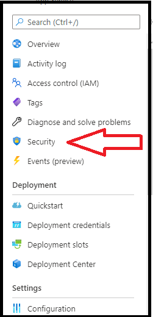

2. When the Security Center page opens, it should display counts for both recommendations and alerts (note that your counts may vary).
     - Review the recommendations, and note that Azure describes the recommendations in this way: "Security Center continuously monitors the configuration of your app services to identify potential security vulnerabilities and recommends actions to mitigate them."
     - ⚠️ **Important**: Your security recommendations may vary, or may not show up at all. If there are no security recommendations, skip ahead to Part 5, and return in a few hours to complete this section. If you have any, most security recommendations will appear within 24 hours.

3. Select the recommendation "FTPS should be required in your web App," as shown in the following image:      

     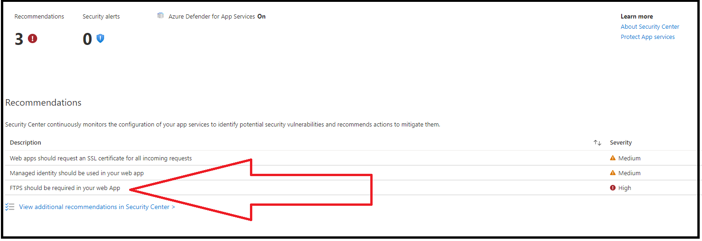

4.  When this page opens, expand the remediation steps, as shown in the following screenshot:

     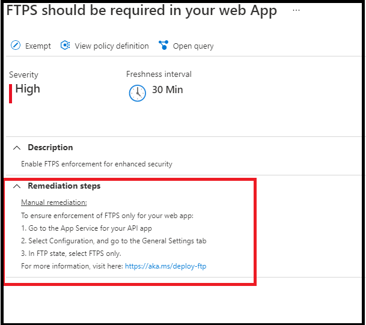

5. Follow the recommended steps to remediate this recommendation.
